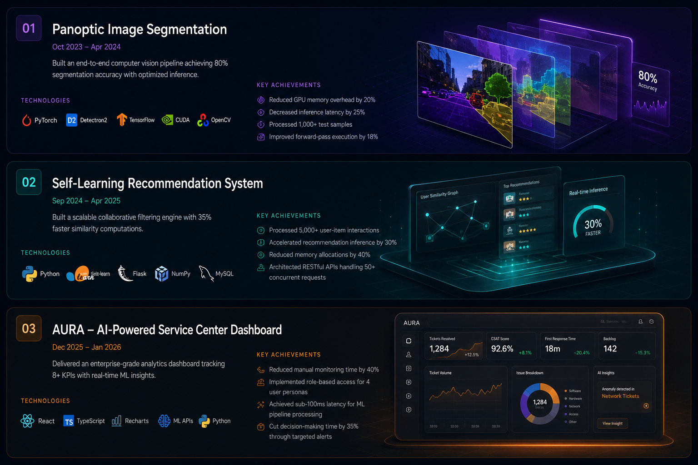

<p align="center">
  
</p>

<div align="center">
  
</div>

---

## 🚀 About Me

```python
class RishabhSingh:
    def __init__(self):
        self.username = "Rishabh Singh"
        self.current_education = "Integrated M.Tech in AI @ VIT"
        self.cgpa = 8.43
        self.location = "India"
        self.interests = [
            "Machine Learning",
            "Deep Learning", 
            "Computer Vision",
            "MLOps",
            "AI Systems"
        ]
        
    def say_hi(self):
        print("Thanks for dropping by! Let's build something amazing together!")

me = RishabhSingh()
me.say_hi()
```

🎓 **Currently pursuing** Integrated M.Tech in Artificial Intelligence at VIT (Oct 2022 – May 2027)  
💡 **Passionate about** developing scalable ML solutions and optimizing deep learning pipelines  
🔭 **Working on** AI-powered systems with real-world impact  
🌱 **Learning** Advanced MLOps, Cloud Computing, and Production ML Systems  
📫 **Reach me at** hrishabh94258@gmail.com

---

## 🛠️ Tech Stack

### Languages


### Machine Learning & Deep Learning


### Data Science & Visualization


### Databases


### DevOps & Tools


---

## 💼 Featured Projects





---

## 📊 GitHub Statistics

<div align="center">
  
  
  
  

<p align="center">
  
</p>
  
</div>

---

<div align="center">
  
</div>

---

## 📫 Let's Connect!

<div align="center">
  
[](https://linkedin.com/in/rishabh-singh-76072b250)
[](mailto:hrishabh94258@gmail.com)
[](https://github.com/Hrishabh-Singh2003)

</div>

---

<div align="center">
  
</div>

<div align="center">

## 💭 Quote of the Day


</div>

---

<div align="center">
  
**"Building the future, one algorithm at a time"** 🚀

</div>
